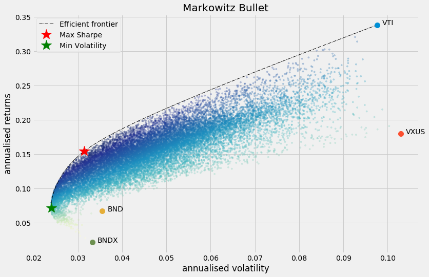

[![Contributors][contributors-shield]][contributors-url]
[![Forks][forks-shield]][forks-url]
[![Stargazers][stars-shield]][stars-url]
[![Issues][issues-shield]][issues-url]
[![MIT License][license-shield]][license-url]
[![LinkedIn][linkedin-shield]][linkedin-url]

<!-- PROJECT LOGO -->
<br />
<p align="center">
  <a href="https://github.com/eleow/roboadvisorSystem">
    
  </a>

  <h3 align="center">Robo Advisor</h3>

  <p align="center">
    Automatic goal-oriented portfolio allocation and rebalancing using a variety of classic and machine learning algorithms
    <br />
    <br />
    <br />
    <a href="https://smartportfolioadvisor.herokuapp.com/">View Heroku demo</a>
    ·
    <a href="https://github.com/eleow/roboadvisorSystem/issues">Report Bug</a>
    ·
    <a href="https://github.com/eleow/roboadvisorSystem/issues">Request Feature</a>
  </p>
</p>

## About

## Getting Started

### Installation

* Before cloning the repository, make sure you have git-lfs installed on your environment. The instructions to do so can be found [here](https://help.github.com/en/github/managing-large-files/installing-git-large-file-storage)

* If using Windows, install [GNU Make](https://www.gnu.org/software/make/) to utilise make commands in the repo.
* Then clone this repo:

```sh
git clone https://github.com/eleow/roboadvisorSystem.git
```

* For frontend code, install prerequisites in "requirements.txt"
* For backend code, install prerequisites in "\SystemCode\backend\requirements.txt"
* Note: zipline uses pandas==0.22.0 (Ignore warning about conflicts)

## Usage

Example usage of most backend functionalities can be found in the Jupyter Notebooks, [Examples](https://github.com/eleow/roboadvisorSystem/blob/master/SystemCode/backend/notebooks)

Robo-advisor system can be started by running the front-end Django server.

### Starting Front-end

Start the front-end by typing the following in your Anaconda environment, in the root directory of the repo

```bash
make front
```

### Examples for Sentiment Analysis

Sentiment analysis example is found in the Jupyter Notebook, [Sentiments](https://github.com/eleow/roboadvisorSystem/blob/master/SystemCode/backend/notebooks/Sentiments.ipynb)

Tweets are obtained via ["Twitter-Get-Old-Tweets-Scraper"](https://github.com/eleow/Twitter-Get-Old-Tweets-Scraper) using Jupyter Notebook, [GetTwitterData.ipynb](https://github.com/eleow/roboadvisorSystem/blob/master/SystemCode/backend/notebooks/GetTwitterData.ipynb). Note that after retrieving a certain number of tweets (14000++), Twitter will block the request with "Sorry, die Anzahl deiner Anfragen ist begrenzt" which means "Sorry, the number of your requests is limited". Then just adjust argument "--until" with the earliest date where it failed and rerun the script after waiting for a while or with a different IP address, and save to a new file.

### Plot Markowitz bullet

Plotting the Markowitz bullet is a *simple one-liner* (using default settings) by just providing _prices_, which is a pandas DataFrame containing adjusted closing prices of the asset (each row is a date and each column is a ticker/id)

```python
from utils import generate_markowitz_bullet
generate_markowitz_bullet(prices)

```

This will generate the following:

* Markowitz Efficient Frontier, represented by a dotted line
* Optimum portfolio based on maximum Sharpe ratio (red star)
* Optimum portfolio based on minimum volatility (green star)
* Random portfolios, plotted with color map applied based on Sharpe ratio



## License

Distributed under the [MIT License](LICENSE)

## Acknowledgements

Backtesting is performed using the Pythonic algorithmic trading library, [Zipline](https://www.zipline.io/)

Markowitz optimisation and Hierarchical Risk Parity implementations are provided by [PyPortfolioOpt](https://pyportfolioopt.readthedocs.io/en/latest/)

Genetic Algorithm implementation is provided by [Distributed Evolutionary Algorithms in Python (DEAP)](https://deap.readthedocs.io/en/master/)

Aesthetic style of plotting Markowitz bullet is borrowed from article by [Ricky Kim](https://towardsdatascience.com/efficient-frontier-portfolio-optimisation-in-python-e7844051e7f)

The front-end UI for the robo advisor system is built using the [Django Web Framework](https://www.djangoproject.com/)

<div>Robot icon made by <a href="https://www.flaticon.com/authors/photo3idea-studio" title="photo3idea_studio">photo3idea_studio</a> from <a href="https://www.flaticon.com/" title="Flaticon">www.flaticon.com</a></div>


<!-- MARKDOWN LINKS & IMAGES -->
<!-- https://www.markdownguide.org/basic-syntax/#reference-style-links -->
[contributors-shield]: https://img.shields.io/github/contributors/eleow/roboadvisorSystem
[contributors-url]: https://github.com/eleow/roboadvisorSystem/graphs/contributors
[forks-shield]: https://img.shields.io/github/forks/eleow/roboadvisorSystem
[forks-url]: https://github.com/eleow/roboadvisorSystem/network/members
[stars-shield]: https://img.shields.io/github/stars/eleow/roboadvisorSystem
[stars-url]: https://github.com/eleow/roboadvisorSystem/stargazers
[issues-shield]: https://img.shields.io/github/issues/eleow/roboadvisorSystem
[issues-url]: https://github.com/eleow/roboadvisorSystem/issues
[license-shield]: https://img.shields.io/github/license/eleow/roboadvisorSystem
[license-url]: https://github.com/eleow/roboadvisorSystem/blob/master/LICENSE
[linkedin-shield]: https://img.shields.io/badge/-LinkedIn-black.svg?style=flat-square&logo=linkedin&colorB=555
[linkedin-url]: https://linkedin.com/in/edmundleow
[product-screenshot]: images/screenshot.png

